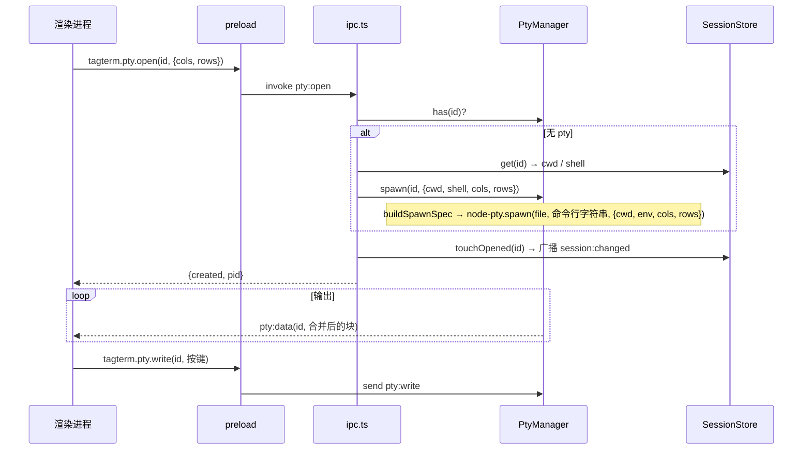
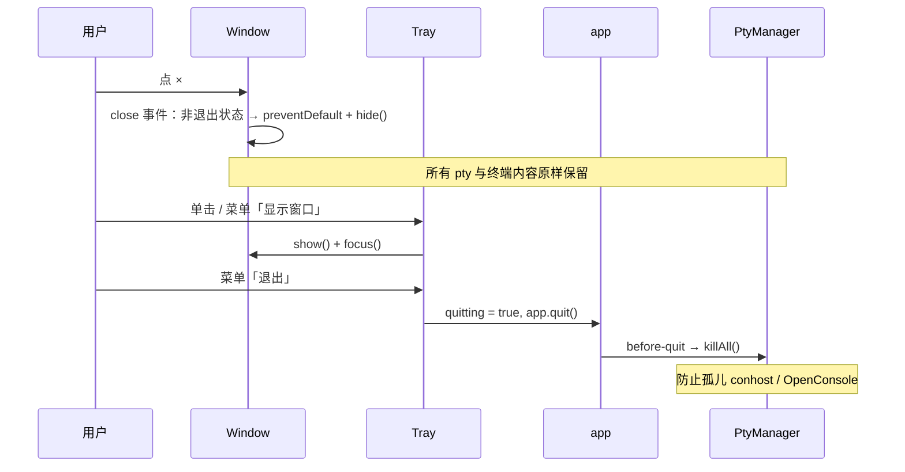

# 后端设计文档

> **本文档职责**：记录后端架构、技术栈、模块边界、API 契约、认证授权与关键业务流程（架构章节），以及后端**项目级代码规范**（「设计模式与约定」章节）。
> 架构章节由 `to-design` 生成（正向 0-to-1 / 逆向）、由 `design-doc-sync` 在每轮开发收尾时同步更新。
> **「设计模式与约定」章节例外**：它是项目级代码规范，只由 `to-design` 首次建立，或由 `tdd` / `read-design-before-code` 列出规范候选、经你显式判定后写入；`design-doc-sync` 不改动它。
> 是 `grill-me-with-design` / `write-a-spec` / `tdd`（GREEN 阶段）读取的约束源之一。
>
> **本项目映射**：TagTerm 是 Electron 桌面应用，没有传统意义的服务端。本文档的"后端" = **Electron 主进程 + preload**。"API 端点"一节记录的是 IPC 通道契约（外加 M3 的本地 HTTP hook 回调）。
> 生成于 2026-09-10（to-design 正向模式），依据：`tagterm-brief.md`、`tagterm-prototype.html`、`ProjectModel/Todo/Plans/tagterm-m1-plan.md`，以及用户当日结论：**终端进程只在应用运行期间存活，退出后不恢复、不重连**。

## 技术栈

| 项 | 选型 |
|----|------|
| 语言 / 框架 | TypeScript 5.9 + Electron 44.3 主进程（内置 Node 24） |
| 持久层 | 自管 JSON 文件：`%APPDATA%\TagTerm\sessions.json`、`tags.json`；无数据库 |
| 终端 | node-pty 1.1（Windows ConPTY，要求 Win10 1809+） |
| 认证 | 暂无（本地单用户桌面应用） |
| 其他中间件 | Electron `Tray` / `dialog` / `Notification`（M3）/ `globalShortcut`（M4）；M3 的 HookServer 用 Node 内置 `http`；M3 的进程树探测用 PowerShell `Get-CimInstance Win32_Process` |
| 构建 / 打包 | electron-vite 5（Vite 7）、electron-builder 26、@electron/rebuild 4 |
| 包管理 | pnpm（`node-linker=hoisted`；`onlyBuiltDependencies` 放行 electron / node-pty / esbuild） |
| 测试 | Vitest 4（node 环境）；PtyManager 用真实 `cmd.exe` 做集成测试 |

## 目录结构与分层

```
src/
├── shared/                    # 两进程共用；禁止 import electron / node / vue
│   ├── models.ts              # Session / Tag / SessionTag / ShellKind / 文件格式 / SessionRuntime
│   ├── ipc.ts                 # 通道名 + 各通道参数与返回类型（IPC 契约唯一真相源）
│   └── api.ts                 # window.tagterm 的 TagTermApi 类型
├── main/
│   ├── index.ts               # 装配层：单实例锁、创建 store / pty / window / tray、注册 IPC、退出清理
│   ├── window.ts              # 平台层：BrowserWindow 参数、close → hide、ready-to-show
│   ├── tray.ts                # 平台层：托盘图标、菜单、"等待你"角标（M3）
│   ├── ipc.ts                 # 接口层：ipcMain.handle / on 薄层，校验参数并转发到服务层
│   ├── pty/
│   │   ├── PtyManager.ts      # 服务层（深模块）：spawn / write / resize / kill / killAll、输出合并
│   │   └── shellArgs.ts       # 纯函数：按 shell 生成 file / 命令行 / env
│   ├── store/
│   │   ├── SessionStore.ts    # 服务层（深模块）：两份 JSON 的读写、版本、原子写；M2 加标签方法
│   │   ├── jsonFile.ts        # readJson / writeJsonAtomic
│   │   └── paths.ts           # %APPDATA%\TagTerm 路径解析（可注入）
│   └── agent/                 # M3
│       ├── AgentDetector.ts   # 三路信号合成 SessionRuntime，产出状态变更事件
│       ├── HookServer.ts      # 127.0.0.1 随机端口 HTTP，接收 Claude Code hooks 回调
│       ├── ClaudeHooksInstaller.ts  # 首次运行向 ~/.claude/settings.json 写 hooks（备份 + 合并）
│       ├── ProcessTreeProbe.ts      # 每 3–5 s 扫描 pty 子进程树
│       └── OutputHeuristics.ts      # 输出静默 / 提示模式判定 + cwd 提示符解析（纯函数）
└── preload/
    └── index.ts               # contextBridge.exposeInMainWorld('tagterm', …)
```

分层与职责：

| 层 | 文件 | 职责 |
|----|------|------|
| 装配层 | `main/index.ts` | 创建各服务实例、把依赖注入进去、绑定 app 生命周期事件；不含业务逻辑 |
| 接口层 | `main/ipc.ts` | 每个通道一个 handler：类型守卫校验参数 → 调服务层 → 返回；不写业务逻辑 |
| 服务层（深模块） | `pty/`、`store/`、`agent/` | 全部业务逻辑；**不 import electron**（需要 Electron 能力时由装配层以回调 / 参数注入） |
| 平台层 | `window.ts`、`tray.ts`、`dialog`、`Notification` | 封装 Electron API 的薄层 |
| preload | `preload/index.ts` | 把 IPC 包装成 SDK 风格的 `window.tagterm`；`sandbox: true`，只用 `contextBridge` / `ipcRenderer` |

## 模块边界

| 模块 | 职责 | 对外能力 | 依赖 | 里程碑 |
|------|------|---------|------|--------|
| PtyManager | 维护 `sessionId → IPty`；spawn / write / resize / kill / killAll；按会话把输出合并（≤16 ms 或 ≥64 KB flush）后回调；进程退出时清理并回调 | `spawn(id, {cwd, shell, cols, rows})`、`has`、`write`、`resize`、`kill`、`killAll`、`onData` / `onExit`（构造注入） | node-pty、shellArgs | M1 |
| shellArgs | 按 `ShellKind` 生成可执行文件、原始命令行字符串、env（追加 `LANG=zh_CN.UTF-8`）；cmd 用 `/k chcp 65001 >nul`，PowerShell 设 `OutputEncoding=UTF8` | `buildSpawnSpec(shell, cwd, env)` | — | M1 |
| SessionStore | `sessions.json` 与 `tags.json` 的加载、CRUD、`version` 校验与迁移、原子写；M2 起管理 Tag 与 SessionTag；数据变更后通过回调通知装配层广播 | `load`、`list`、`create`、`update`、`remove`、`touchOpened`；M2：`listTags`、`createTag`、`updateTag`、`removeTag`、`attachTag`、`detachTag`；M4：`reorder`、`exportAll`、`importAll` | jsonFile、paths | M1 / M2 / M4 |
| jsonFile | 读 JSON；写 JSON 先写 `.tmp` 再 `rename` 覆盖 | `readJson`、`writeJsonAtomic` | fs | M1 |
| Window | 创建主窗口；安全参数；关闭 → 隐藏；显示 / 聚焦 | `createMainWindow`、`showMainWindow` | electron | M1 |
| Tray | 托盘图标、tooltip、右键菜单（显示窗口 / 退出）；M3 显示"等待你"数量角标 | `createTray(deps)`、`setBadge(n)` | electron | M1 / M3 |
| ipc | 注册全部通道 | `registerIpc(deps)` | 上述服务 | M1 起 |
| preload | SDK 风格 API | `window.tagterm` | ipcRenderer | M1 起 |
| AgentDetector | 综合 hooks / 输出启发式 / 进程树三路信号，维护每个会话的 `SessionRuntime`（agent、status、cwdNow），产出变更事件；被查看时 done → idle | `onStatus`（回调）、`markViewed(id)`、`list()` | PtyManager 输出事件、HookServer 事件、ProcessTreeProbe、OutputHeuristics | M3 |
| HookServer | 监听 `127.0.0.1` 随机端口；解析 `/hook?event=&cwd=`；按 cwd 反查会话后转交 AgentDetector | `start()` → port、`onHook` | node http、SessionStore（cwd 反查） | M3 |
| ClaudeHooksInstaller | 首次运行时把 hook 命令写入用户级 `~/.claude/settings.json`：先备份，只增不覆盖已有 hooks | `ensureInstalled(port)` | fs | M3 |
| ProcessTreeProbe | 每 3–5 s 用 PowerShell 查 `Win32_Process`，按 ParentProcessId 递归找每个 pty 的子进程，识别 claude / gemini / codex 等进程是否存在 | `onSnapshot` | child_process | M3 |
| OutputHeuristics | 纯函数：判断输出静默 >1.5 s 且末尾匹配 `(y/n)` / `Allow` / `❯` / `>` 等模式；从输出流解析最后一个 `C:\path>` / `PS C:\path>` 提示行得到 cwdNow | `classify(tail, silentMs)`、`parsePromptCwd(text, shell)` | — | M3 |
| Notifications | "xxx 等你确认" / "xxx 完成" 系统通知 | `notify(title, body)` | electron Notification | M3 |
| Shortcuts | 全局快捷键唤出窗口 | `registerGlobalShortcut(accelerator)` | electron globalShortcut | M4 |

边界规则：

- 会话的**持久数据**只由 SessionStore 拥有；**运行时状态**（pty 存活、agent、status、cwdNow）只在内存，由 PtyManager 与 AgentDetector 拥有，不落盘。
- **会话生命周期 = 应用生命周期**：托盘「退出」与 `before-quit` 必 `killAll`；下次启动只恢复会话列表，不恢复任何终端进程，也不做重连（用户 2026-09-10 决定，原简报 M4 的"独立子进程 + 重连"取消）。
- 主进程是持久数据的真相源：任何变更后广播全量列表（`session:changed` / `tag:changed`），渲染进程只镜像。
- 服务层不 import electron；`dialog.showOpenDialog` 之类由接口层直接调用。

## API 端点

> 本节记录 IPC 通道契约（三类：invoke 请求响应 / send 单向 / event 主进程广播）与 M3 的本地 HTTP 端点。参数与返回类型定义在 `src/shared/ipc.ts`，本表与之一致。

| 类型 | 通道 | 说明 | 参数 | 返回 / 载荷 | 里程碑 |
|------|------|------|------|------------|--------|
| invoke | `app:get-version` | 应用版本 | — | `string` | M1 |
| invoke | `session:list` | 会话列表 | — | `Session[]` | M1 |
| invoke | `session:create` | 新建会话；name 缺省取目录末段，shell 缺省 cmd.exe，sortOrder = 最大值 + 1 | `CreateSessionInput { cwd, name?, shell?, tagIds?(M2) }` | `Session` | M1 |
| invoke | `session:update` | 改名 / 换 shell / startupCmd / 排序 | `id, SessionPatch` | `Session` | M1 |
| invoke | `session:remove` | 移除会话：kill 其 pty → 删记录 → 删其 SessionTag | `id` | `void` | M1 |
| invoke | `session:pick-directory` | 系统目录选择框 | — | `string \| null` | M1 |
| invoke | `pty:open` | 幂等：无 pty 则按会话 cwd / shell spawn，有则复用；更新 `lastOpenedAt` | `sessionId, PtySize` | `{ created: boolean; pid: number }` | M1 |
| invoke | `pty:resize` | 同步终端尺寸 | `sessionId, PtySize` | `void` | M1 |
| invoke | `pty:kill` | 结束该会话的 pty | `sessionId` | `void` | M1 |
| invoke | `pty:is-alive` | pty 是否在运行 | `sessionId` | `boolean` | M1 |
| send | `pty:write` | 键入 / 唤起按钮写入 | `sessionId, data` | — | M1 |
| event | `pty:data` | 合并后的输出 | — | `sessionId, data` | M1 |
| event | `pty:exit` | pty 退出 | — | `PtyExitEvent { sessionId, exitCode, signal? }` | M1 |
| event | `session:changed` | 会话数据变更后全量广播 | — | `Session[]` | M1 |
| invoke | `tag:list` | 标签与关联 | — | `{ tags: Tag[]; sessionTags: SessionTag[] }` | M2 |
| invoke | `tag:create` | 新建标签；同名返回已有；颜色按 `TAG_COLORS` 轮转 | `name, color?` | `Tag` | M2 |
| invoke | `tag:update` | 改名 / 换色 / 排序 | `id, TagPatch` | `Tag` | M2 |
| invoke | `tag:remove` | 删标签并解除所有关联，会话保留 | `id` | `void` | M2 |
| invoke | `session-tag:attach` | 给会话加标签（幂等） | `sessionId, tagId` | `void` | M2 |
| invoke | `session-tag:detach` | 从会话移除标签 | `sessionId, tagId` | `void` | M2 |
| event | `tag:changed` | 标签或关联变更后全量广播 | — | `{ tags, sessionTags }` | M2 |
| invoke | `agent:list` | 全部会话运行时状态 | — | `SessionRuntime[]` | M3 |
| invoke | `agent:mark-viewed` | 会话被查看：done → idle | `sessionId` | `void` | M3 |
| event | `agent:status` | 某会话运行时状态变化 | — | `SessionRuntime` | M3 |
| invoke | `session:reorder` | 拖拽排序后整体写回 | `ids: string[]` | `void` | M4 |
| invoke | `app:export-config` / `app:import-config` | 配置导入导出（格式待确认） | 待确认 | 待确认 | M4 |

M3 本地 HTTP 端点（HookServer）：

| 方法 | 路径 | 说明 | 认证 |
|------|------|------|------|
| GET | `http://127.0.0.1:<随机端口>/hook?event=<Notification\|Stop\|UserPromptSubmit\|SessionStart\|SessionEnd>&cwd=<路径>` | Claude Code hooks 回调；主进程按 cwd 反查会话；响应 204 | 仅绑定回环地址；是否加启动期随机 token 见「待确认问题」 |

运行时状态类型（M3，`shared/models.ts`）：

```ts
export type AgentKind = 'claude' | 'gemini' | 'codex';          // 是否加 pi 见待确认
export type AgentStatus = 'idle' | 'working' | 'blocked' | 'done';
export interface SessionRuntime {
  sessionId: string;
  alive: boolean;               // pty 是否在运行
  agent: AgentKind | null;      // 当前在哪个工具里（进程树为准）
  status: AgentStatus;
  cwdNow?: string;              // 从提示符解析到的当前目录
  pendingHint?: string;         // 等待确认时的最后一行提示（可选）
}
```

## 核心业务流程

### 1. 打开会话并显示终端（M1）



规则：pty 只在首次点击会话时 spawn，启动时不预热；`pty:open` 幂等，重复打开只复用；渲染进程整页重载后不回放历史输出（终端从空白开始，按回车即出提示符）。

### 2. 关闭窗口、托盘与退出（M1）



规则：`window-all-closed` 不退出；单实例锁，二次启动只聚焦已有窗口；退出即结束所有终端，下次启动不恢复。

### 3. 移除会话（M1）

渲染进程确认（文案 `移除会话 "x"？终端进程会被结束。`）→ `session:remove` → PtyManager.kill → SessionStore.remove（M2 起同时删 SessionTag）→ 广播 `session:changed` → 渲染进程销毁该会话的 xterm 实例并关闭其标签页。

### 4. 新建会话（M1 / M2）

`session:pick-directory` 打开系统目录选择框 → 渲染进程填表 → `session:create`（M2 带 `tagIds`，当前筛选中的标签预选）→ SessionStore 写入 → 广播 → 渲染进程立即选中并打开终端。

### 5. agent 状态判定（M3）

状态机（与原型一致）：

```
idle ──(UserPromptSubmit hook / 输出持续流动)──▶ working
working ──(Notification hook / 静默 >1.5 s 且末尾匹配提示模式)──▶ blocked
blocked ──(用户输入后输出恢复)──▶ working
working ──(Stop hook / 静默且无提示)──▶ 会话正被查看 ? idle : done
done ──(agent:mark-viewed)──▶ idle
任意 ──(进程树发现 agent 进程消失 / pty 退出)──▶ idle，agent = null
```

三路信号的优先级：hooks（仅 Claude Code）> 输出启发式 > 进程树。进程树只负责回答"当前在哪个工具里"与"工具是否已退出"，不推动 working / blocked。状态变化 → `agent:status` 事件 → 渲染进程（左栏、标签页、状态栏）+ Tray 角标（blocked 数量）+ 系统通知（进入 blocked：「xxx 等你确认」；进入 done：「xxx 完成」）。

### 6. Claude Code hooks 安装（M3）

首次运行：读取 `~/.claude/settings.json` → 备份为 `settings.json.bak-<时间戳>` → 在 `hooks` 中为 `Notification` / `Stop` / `UserPromptSubmit` / `SessionStart` / `SessionEnd` 追加命令 `curl -s "http://127.0.0.1:<port>/hook?event=<事件>&cwd=%CD%"`（只增不删，已存在同样命令则跳过）→ 写回。端口每次启动随机，因此每次启动都要校验并更新该命令。

### 7. cwd 追踪（M3）

会话目录固定，但用户在终端里 `cd` 后路径条要跟着显示。OutputHeuristics 从输出流中正则抓最后一个提示行：cmd 为 `^[A-Za-z]:\\[^>\r\n]*>`，PowerShell 为 `^PS [A-Za-z]:\\[^>\r\n]*>`；结果写入 `SessionRuntime.cwdNow`。不使用读取进程 cwd 的 Windows API。

## 认证授权

暂无。本地单用户桌面应用，不存在登录与权限模型。

安全边界：

- 渲染进程 `contextIsolation: true`、`sandbox: true`、`nodeIntegration: false`；CSP `script-src 'self'`，`style-src 'self' 'unsafe-inline'`（xterm DOM 渲染器动态注入 style）。
- 渲染进程能做的事以 `window.tagterm` 暴露的函数为限；接口层对每个参数做类型守卫。
- HookServer 只绑定 `127.0.0.1`；是否为每次启动生成随机 token 拼进 hook URL 以防本机其他进程伪造回调，见「待确认问题」。

## 设计模式与约定（后端代码规范）

> 本章节约束"代码怎么写"，与上文架构章节的"做什么、边界在哪"正交。每条已填规范末尾以 `〔来源：…〕` 注明依据：配置文件路径 / 代表性源码路径（抽样 n/m）/ 决策产物路径（Grill、Plan、RFC）/ 手工约定。没有来源的条目视为待核实。
> 逆向模式只写本项目代码与配置的证据，无证据处保留占位词，禁止用社区惯例填充。多种写法并存的项记入「待确认问题」待裁决。
>
> **状态说明（2026-09-10）**：来源写 `tagterm-brief.md` 或 Plan 的条目已定；来源写 `TS / Electron 社区基线草案，待确认` 的条目是正向模式按社区基线草拟的，**等你一次性确认**后我把来源改为 `社区基线，用户确认 <日期>`；在此之前 `tdd` 会把它们视为未决。

### 架构级模式

- 依赖注入：服务类通过构造参数接收依赖与回调（`new PtyManager({ onData, onExit })`、`new SessionStore(dir)`），不在内部 new 或读全局；测试时传临时目录 / 假回调 〔来源：`Todo/Plans/tagterm-m1-plan.md` §3.4〕
- 配置管理：无配置中心、无环境变量开关；路径与常量集中在 `main/store/paths.ts` 与 `shared/` 常量文件 〔来源：`tagterm-brief.md` §2 存储决策〕
- 主进程为真相源：持久数据变更后广播全量列表，渲染进程只镜像不回写 〔来源：`Todo/Plans/tagterm-m1-plan.md` §3.2〕

### 代码格式化

- Prettier 3：2 空格缩进、单引号、无分号、行宽 100、尾逗号 `all`（create-vue 默认风格）〔来源：TS / Electron 社区基线草案，待确认〕
- ESLint 9 flat config：`@eslint/js` recommended + `typescript-eslint` recommended；提交前无 error 〔来源：TS / Electron 社区基线草案，待确认〕
- `tsconfig` 开 `strict`；主进程与渲染进程分两份 tsconfig（node / web），`shared/` 两边共用 〔来源：`Todo/Plans/tagterm-m1-plan.md` §1〕

### 分层职责

- 装配层（`main/index.ts`）→ 接口层（`main/ipc.ts`）→ 服务层（`pty/`、`store/`、`agent/`）→ Node / node-pty / fs；平台层（`window.ts`、`tray.ts`）只被装配层调用 〔来源：`Todo/Plans/tagterm-m1-plan.md` §1 分层规则〕
- 接口层不写业务逻辑：校验参数 → 调服务 → 返回 〔来源：同上〕
- 服务层不 import electron；需要 Electron 能力时由装配层注入回调 〔来源：同上〕

### 异常处理

- 服务层抛 `Error`（message 用中文、面向用户可读），不吞异常；`ipcMain.handle` 内抛出即以 rejected Promise 传到渲染进程，由调用处提示 〔来源：TS / Electron 社区基线草案，待确认〕
- 主进程顶层注册 `process.on('uncaughtException')` 与 `unhandledRejection`：记录日志 + `dialog.showErrorBox`，不静默 〔来源：TS / Electron 社区基线草案，待确认〕
- 坏 JSON 文件：加载失败即抛错并提示文件路径，**不**静默重置为空 〔来源：`Todo/Plans/tagterm-m1-plan.md` Slice 2〕

### 接口与响应

- IPC invoke 直接返回数据对象，不做 `code / message / data` 包装；失败走 reject 〔来源：`Todo/Plans/tagterm-m1-plan.md` §3.2〕
- 入参在接口层用类型守卫校验（字符串非空、`ShellKind` 在枚举内、`cols/rows` 为正整数），非法即抛 〔来源：TS / Electron 社区基线草案，待确认〕
- 无分页；列表全量返回（会话数量级为几十）〔来源：`tagterm-brief.md` §1 规模〕
- 通道命名 `域:动作`，全小写 kebab-case（`session:pick-directory`）；事件通道用名词过去式或名词（`session:changed`、`pty:data`）〔来源：`Todo/Plans/tagterm-m1-plan.md` §3.2〕

### 日志

- 主进程用 `console.*`，每条带模块前缀 `[pty]` / `[store]` / `[agent]`；开发期输出到终端，生产期是否落文件见「待确认问题」〔来源：TS / Electron 社区基线草案，待确认〕
- **不记录终端输出内容与键入内容**（可能含密钥）；只记录事件（spawn / exit / 错误）〔来源：TS / Electron 社区基线草案，待确认〕

### 注释与事务

- 注释用中文；公共方法与非显然逻辑必写，显然代码不写；标识符英文 〔来源：`tagterm-brief.md` §2 语言决策〕
- 事务边界 = 一次原子写：每次变更把整份 JSON 先写 `.tmp` 再 `rename`；不做部分写入 〔来源：`tagterm-brief.md` §3 SessionStore〕

### 命名约定

| 对象 | 规范 | 举例 |
|------|------|------|
| 常量 | 全大写 + 下划线 〔来源：TS / Electron 社区基线草案，待确认〕 | `FLUSH_INTERVAL_MS` |
| 布尔变量 | is / has / can 前缀 〔来源：TS / Electron 社区基线草案，待确认〕 | `isQuitting` |
| 类 | PascalCase；文件名同类名 〔来源：`Todo/Plans/tagterm-m1-plan.md` §1〕 | `PtyManager.ts` |
| 方法 / 变量 | camelCase 〔来源：TS / Electron 社区基线草案，待确认〕 | `killAll` |
| 非类模块文件 | camelCase 〔来源：`Todo/Plans/tagterm-m1-plan.md` §1〕 | `shellArgs.ts`、`jsonFile.ts` |
| IPC 通道 | `域:动作`，kebab-case 〔来源：`Todo/Plans/tagterm-m1-plan.md` §3.2〕 | `session:pick-directory` |
| 里程碑标注 | 未实现的模块 / 通道在注释与文档中标 `M2` / `M3` / `M4` 〔来源：`tagterm-brief.md` §4〕 | `// M3: AgentDetector` |

### 跨层命名对照

> 同一业务字段在数据库、后端、API JSON、前端四处的写法与转换位置，避免跨层翻译歧义。数据库侧规范见 `database/sql.md`「约定」。

| 层 | 规范 | 举例 | 转换在哪里完成 |
|----|------|------|--------------|
| JSON 文件字段 | camelCase | `createdAt` | — |
| 主进程实体字段 | camelCase，与文件一致（同一个 `Session` 类型） | `createdAt` | 无转换 |
| IPC 载荷字段 | camelCase，直接传实体 | `createdAt` | 无转换（structured clone） |
| 渲染进程字段 | camelCase，共用 `shared/models.ts` 类型 | `createdAt` | 无转换 |

〔来源：`tagterm-brief.md` §3 数据模型 —— 四层共用一份 TS 类型〕

## 待确认问题

1. **HookServer 防伪造**：是否每次启动生成随机 token 拼进 hook URL（`/hook?token=…`），主进程校验不符即忽略。推荐加（成本极低，防本机其他进程误触状态）。—— M3
2. **唤起工具列表是否加入 `pi`**：用户 2026-09-10 提到会用 `pi` 启动 pi；本机已安装 claude / gemini / pi，未装 codex。推荐：`AgentKind` 与唤起按钮改为可配置列表，默认 `claude / gemini / codex / pi`，启动时探测 PATH，未安装的不显示；进程树识别同时匹配 `pi`。—— M1（按钮）/ M3（识别）
3. **输出启发式的提示模式清单与阈值**：简报给出 `(y/n)`、`Allow`、`❯`、`>` 与 1.5 s；`>` 与 cmd 提示符 `C:\path>` 重叠，需要排除"末行是 shell 提示符"的情况。—— M3
4. **进程树轮询间隔**：简报给 3–5 s，推荐固定 4 s，且只在有 pty 存活时轮询。—— M3
5. **生产期日志是否落文件**（`%APPDATA%\TagTerm\logs\`）与滚动策略。—— M4
6. **全局快捷键默认键位**（简报未给）。推荐 `Ctrl+Alt+T`，可在设置中改。—— M4
7. **配置导入导出的格式**：推荐把 `sessions.json` + `tags.json` 打成一份 `tagterm-config.json`（含各自 version）。—— M4
8. **pty 退出后的重启方式**（原型未画）：默认按 Plan §9 #2 推荐执行 —— 终端保留最后输出并追加 `[进程已退出，代码 N]`，再次点击该会话或在终端按回车即重新 spawn。—— M1
9. **shell 可用性探测**：新建会话的 Shell 下拉只显示 PATH 上存在的 shell（本机无 pwsh）。默认按 Plan §9 #3 推荐执行。—— M1
