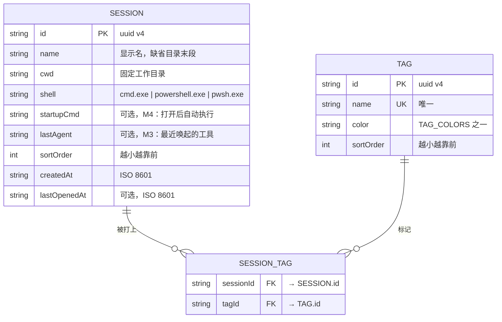

# 数据库 ER 图

> **本文档职责**：用 Mermaid `erDiagram` 语法展示实体-关系（ER）图，并对每个实体及其关系作简要描述。
> 详细的表关系基数说明见 `database-relations.md`，建表 SQL 见 `sql.md`。
>
> **本项目映射**：持久化是两份 JSON 文件（`sessions.json`、`tags.json`），实体即文件中的数组元素；"FK" 表示 id 引用，由代码保证一致性。生成于 2026-09-10（to-design 正向模式）。

## ER 图

文件归属：`SESSION` 存于 `sessions.json`；`TAG` 与 `SESSION_TAG` 存于 `tags.json`。两份文件各带顶层 `version`。

## 实体简要描述

| 实体 | 说明 |
|------|------|
| SESSION | 一个固定工作目录的终端定义。持久的只有"在哪个目录、用什么壳、叫什么名"；终端进程与其中运行的 agent 都是运行时的，应用退出即结束、下次启动不恢复 |
| TAG | 用户自定义分类，有名称与颜色；左栏按它分组、筛选 |
| SESSION_TAG | 会话与标签的多对多关联行；同一会话出现在它所有标签的分组下 |

不落盘、仅内存的运行时对象（`SessionRuntime`：alive / agent / status / cwdNow）见 `backend.md`，不进 ER 图。
