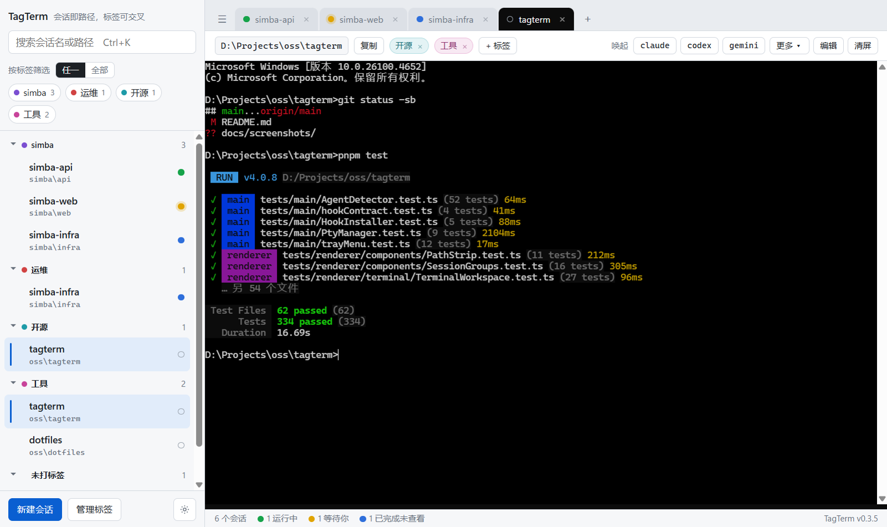
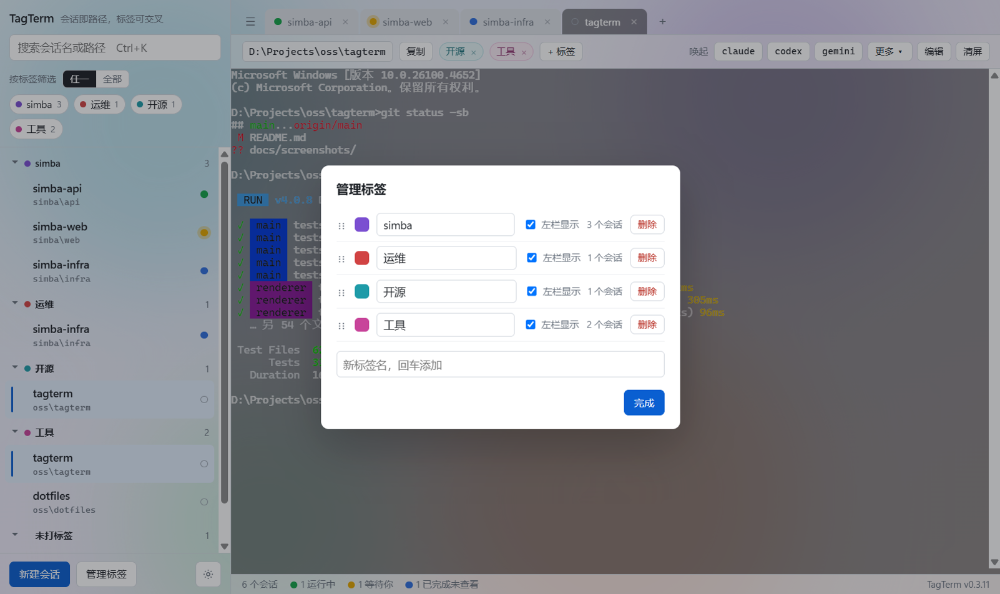
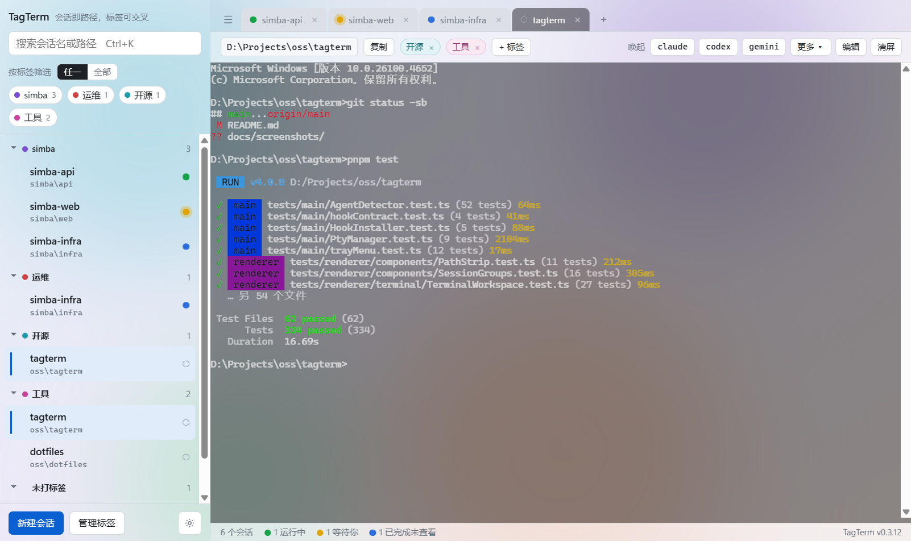
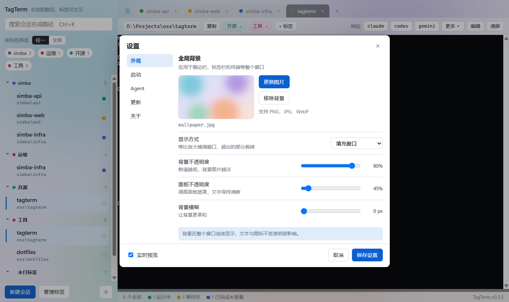

# TagTerm

一个 Windows 桌面小工具：**把常用项目目录保存成终端会话**，点一下就打开固定在该目录的 cmd / PowerShell；多个会话像浏览器标签页一样切换，关窗进托盘、终端进程不中断。会话里跑着 `claude`、`codex`、`gemini`、`pi` 这类命令行 AI 工具时，左栏的状态点告诉你哪个在跑、哪个在等你确认、哪个已经做完。



> 截图用的是演示数据（`pnpm screenshots` 生成），不是真实机器上的会话。

## 为什么做它

同时在好几个项目里用 AI 编程工具时，每次都要找到项目文件夹、在地址栏敲 `cmd`、再敲 `claude`；开了一堆终端窗口后，又分不清哪个窗口里的工具停下来在等你批准。TagTerm 把这两件事收进一个窗口：会话即路径，状态一眼可见。

## 功能（v0.3.9）

### 会话与终端

- **会话即路径**：新建会话只需选一个目录，名称缺省取目录末段，Shell 可选 cmd.exe / PowerShell / pwsh。右键会话可编辑名称、目录、Shell，也可移除。
- **重启终端**：右键会话选「重启终端」，结束它的终端（连同里面在跑的程序）并在同一目录起一个新的，切到该会话。终端里有程序在跑时先确认，确认框写出是哪个程序；终端还没打开时这一项是灰的。
- **真实终端**：node-pty（ConPTY）+ xterm.js，UTF-8 中文不乱码，Claude Code 这类全屏 TUI 正常显示。一个会话一个终端实例，切换不丢内容。
- **标签页**：打开的会话显示为标签页；关闭标签页不结束进程。重启应用后恢复上次的标签页与当前页（只有当前页立即启动终端）。
- **剪贴板**：Ctrl+V / Shift+Insert 粘贴，Ctrl+Shift+C 复制，Ctrl+C 有选区复制、无选区中断，右键有选区复制、无选区粘贴。
- **终端内搜索**：Ctrl+Shift+F 在终端右上角打开搜索框，输入即高亮全部匹配并显示「第 N 处，共 M 处」，Enter / Shift+Enter 跳到下一处 / 上一处，Esc 关闭。查的是这个终端的全部回滚内容，不区分大小写。
- **字号**：在终端上按住 Ctrl 滚动滚轮调文字大小（10–32，触摸板双指捏合也行），所有终端一起变，下次打开仍是这个字号；Ctrl+0 恢复默认 14。

### 标签

- 一个会话可挂多个标签，左栏按标签分组，同一会话出现在它每个标签下，悬停时各处副本一起高亮；分组可折叠并记住。
- 顶部按「任一」（并集）/「全部」（交集）筛选；搜索框按名称或路径过滤（Ctrl+K 聚焦，终端里也生效）。
- 组内整行拖拽排序；「管理标签」里改名、换色、拖拽排序、从左栏隐藏整组、删除。



### Agent 状态

每个打开的会话都有一个状态点，同步显示在左栏、标签页和底部状态栏：

| 状态点 | 含义 |
|---|---|
| 绿 | 运行中：工具正在干活 |
| 黄 | 等你确认：权限请求、提问、网络断开后在倒数重试、回合因 API 出错终止 |
| 蓝 | 已完成未查看：这一轮结束了，你还没切过去看 |
| 空心 | 空闲 |

- **托盘图标**跟随最需要你处理的状态：黄 > 蓝 > 绿；有会话等你确认时托盘图标黄红交替闪烁，任务栏按钮上同时显示一个小圆点。
- **系统通知**：会话进入「等你确认」（且你不在看它）或一轮完成时弹通知，点通知直接切到该会话。
- **判定来源**：进程树识别会话里当前跑的是哪个工具；Claude Code 与 Codex 可在「设置 → Agent」一键安装 hooks，状态最准确；没装 hooks 时只看屏幕上能自证的信号（在走的计时器、在倒数的重试横幅），不靠匹配界面文案。

### 路径条与唤起命令

- 路径条显示当前目录：在终端里 `cd` 之后跟着变。**点路径**即在资源管理器打开该文件夹，「复制」复制完整路径。
- 当前会话的标签胶囊可直接增删。
- **唤起命令**：路径条右侧的一排按钮，点击等于在终端敲 `claude⏎`。首次运行按 PATH 自动生成，之后在「编辑」里自定义任意命令、设常用或收进「更多 ▾」、拖拽排序。
- **在路径条上直接拖动**：像浏览器收藏夹栏一样，按钮之间直接拖动换位；拖到「更多 ▾」上停半秒会展开，可以放进列表任意位置，也能从「更多」里拖回路径条。拖出去松手原样弹回，不会删除（删除在「编辑」里）。
- **有程序在跑时置灰**：终端里在跑 Claude Code、`npm run dev` 之类的任何程序时，唤起按钮与「清屏」置灰，悬停提示当前在哪个程序里 —— 这时点下去，命令会被当成一条消息发给那个程序。回到提示符后自动恢复。

### 外观、托盘与更新

- **全局背景**：一张图片铺满整个窗口，侧栏、标签栏和终端都半透明透出背景；显示方式、背景不透明度、面板不透明度、模糊都可调，改动实时预览，「保存设置」才生效。

  

  

- **全局快捷键**：默认 Ctrl+Alt+T，在任何地方按下即唤出 TagTerm，焦点直接落在当前终端；窗口在前台时再按一下藏回托盘。「设置 → 启动」里可以换组合或关掉，被别的程序占用时那里会提示。
- **托盘常驻**：点 × 只隐藏到托盘，所有终端继续运行；托盘菜单：显示窗口 / 设置 / 退出（退出会结束全部终端）。单实例，二次启动只聚焦已有窗口。
- **开机自启**：登录后静默进托盘，不弹窗口。
- **检查更新**：「设置 → 更新」检查、下载、安装并重启；启动 10 秒后自动检查一次，只提示不自动下载。

## 安装

到 [Releases](https://github.com/raingossamer/tagterm/releases) 下载 `TagTerm-Setup-x.y.z.exe` 运行即可。要求 Windows 10 1809 及以上。安装包未签名，首次运行 SmartScreen 会提示。

装好后建议到「设置 → Agent」打开 Claude Code / Codex 的 hooks 开关，状态点会准确很多。以后升级到新版本时，已打开的 hooks 会在启动时自动更新到新版本，不用再手动开关。

### 换电脑迁移

1. 在旧电脑上从托盘「退出」TagTerm，确保数据已写盘。
2. 把 `%APPDATA%\TagTerm\` 下的 `sessions.json`、`settings.json`、`tags.json` 拷到新电脑的同一位置，再启动 TagTerm。
3. 在新电脑上到「设置 → Agent」重新打开 hooks 开关，它们改的是新电脑上的 `~/.claude` / `~/.codex`。
4. 背景图只记了路径：把图片一并拷过去，在「设置 → 外观」里重新选一次。

会话目录如果在新电脑上不存在，会话照样保留，打开终端时会提示打不开。终端字号记在本机界面里，不在这三个文件中，到新电脑上用 Ctrl+滚轮重新调一下即可。

## 数据与隐私

- 应用自己的数据只有三个 JSON 文件，都在 `%APPDATA%\TagTerm\`：`sessions.json`（会话）、`settings.json`（唤起命令、背景与全局快捷键）、`tags.json`（标签与关联）。卸载不会删除它们。
- 打开 hooks 开关会改动 `~/.claude/settings.json` 或 `~/.codex/hooks.json`：写前先备份为 `<文件>.tagterm-bak-<时间戳>`，只增删带 TagTerm 标识的条目，关掉开关即删除。hooks 只把事件发到本机 `127.0.0.1` 上的端口。
- 日志只记事件与错误，写在 `%APPDATA%\TagTerm\logs\`，单个文件 1 MB 轮转、保留 3 份；「设置 → 关于」可以一键打开日志目录，遇到问题时把它发给开发者即可。
- 终端输出与键入内容不落盘、不进日志。除「检查更新」访问 GitHub Releases 外，应用不联网。

## 已知限制

- 没装 hooks 时，状态只能靠屏幕信号判断：Claude Code 的权限对话框期间可能仍显示「运行中」，回合因 API 出错终止与正常结束分不清。
- 唤起按钮的置灰靠每 2 秒一次的进程树扫描，程序启动或结束后最多晚 2 秒才变；一闪而过的命令来不及置灰。
- 从终端里拉起、之后一直开着的窗口程序（如 `start notepad`）也算「有程序在跑」，按钮会一直灰到它关掉。
- 全局快捷键被别的程序先占用时，按下去不会有任何反应（系统把它交给了那个程序），要到「设置 → 启动」里看提示并换一个组合。
- 全屏程序（vim、less 这类）里的终端内搜索只查当前画面，不含它们退出后才会回来的滚动内容。
- 应用退出后终端进程随之结束，下次启动不恢复进程与输出。
- 安装包未签名。

## 开发

```bat
pnpm install
pnpm dev          :: 开发模式（electron-vite，HMR；F12 开关开发者工具）
pnpm test         :: vitest：main（node，含真实 cmd.exe 集成测试）+ renderer（happy-dom）
pnpm typecheck    :: vue-tsc + tsc
pnpm lint         :: ESLint（不读类型的推荐集，任何告警都算失败）
pnpm format:check :: Prettier 格式检查（src / tests / scripts）
pnpm build        :: 打 nsis 安装包到 dist/（同时产出 latest.yml 与 .blockmap）
pnpm build:dir    :: 只出 dist/win-unpacked，不打安装包
pnpm screenshots  :: 重新生成 docs/screenshots/ 下的 README 截图
```

无人值守烟测：真实启动 Electron，跑完自动退出，结果以 `[smoke] {...}` JSON 打到 stdout，最后一行 `[smoke-verdict]` 是判定结论，发布流水线只认这一行的 `"ok":true`。它使用独立的 userData、数据目录与假主目录，不碰真实数据，也不改你的 hooks 配置。烟测要在前台单独运行，窗口拿不到焦点时剪贴板相关步骤会失败。

```bat
set TAGTERM_SMOKE=1 && pnpm dev
```

README 截图由 `scripts/screenshots/` 生成：用真实的渲染进程构建产物，配一个内存里的假后端（演示会话、标签、状态与终端输出）。它不启动 shell、不读写任何用户文件，截图里只会出现脚本里写死的演示内容。

### 技术栈

Electron 44 · Vue 3.5 + Pinia · TypeScript 5.9 · electron-vite 5 · node-pty 1.1 · @xterm/xterm 6 · @vscode/windows-process-tree · electron-builder 26 · electron-updater 6 · Vitest 4 · ESLint 10。

### 结构

```
src/shared/     两进程共用：数据模型、IPC 契约（通道名 + 参数 / 返回类型）、window.tagterm 的类型
src/main/       主进程：装配（index）/ 接口层（ipc）/ 服务层（pty、store、updater、agent）/ 平台层（window、tray、platform）
src/main/agent/ agent 运行时子系统：状态机、进程树探针、hooks 端点与安装器、屏幕信号判定
src/preload/    contextBridge 暴露 SDK 风格的 window.tagterm
src/renderer/   Vue 渲染进程：stores（镜像主进程数据 + 筛选 UI 状态）、composables、terminal（会话生命周期核心 + xterm 实例池）、components
tests/          与 src 对应的单元 / 集成测试
scripts/        README 截图脚本
```

安全基线：`contextIsolation` + `sandbox`，无 Node 集成，CSP `script-src 'self'`；渲染进程只能通过 `window.tagterm` 里的函数与主进程交互，主进程对每个参数做类型守卫。

### 发布

1. 升 `package.json` 的 `version`，提交并推送。
2. 在 GitHub Actions 里手动运行 **Release** 工作流：它跑类型检查与单测、打安装包、对打包版跑烟测，然后把 `latest.yml`、`TagTerm-Setup-x.y.z.exe`、`.blockmap` 传到 Release `vx.y.z`。
3. 已安装的用户在「设置 → 更新」即可升级。

## 路线图

- 配置导入导出

## 许可

[MIT](LICENSE)
